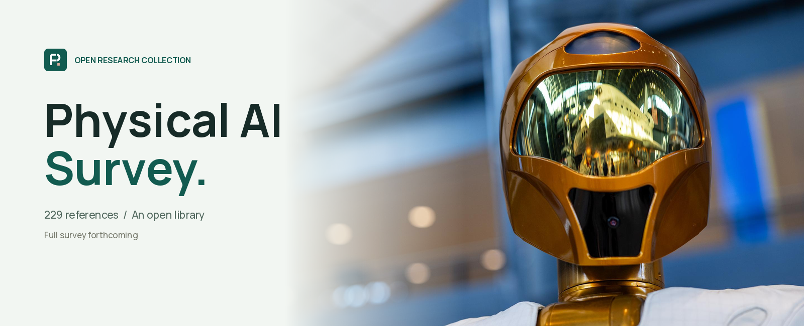
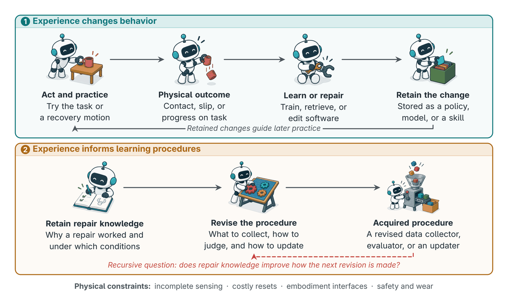
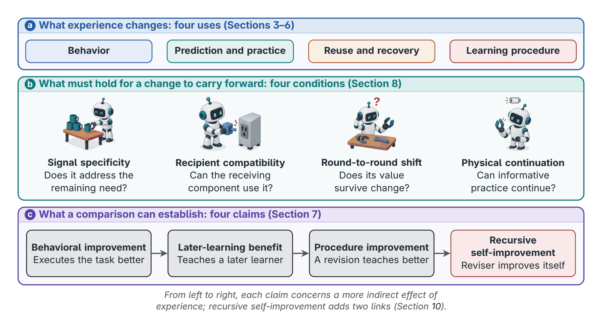
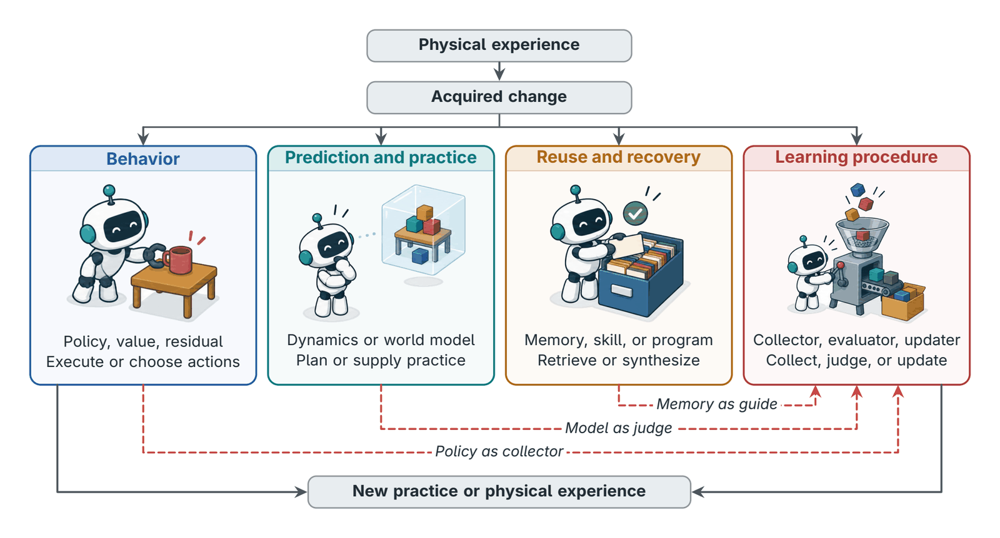
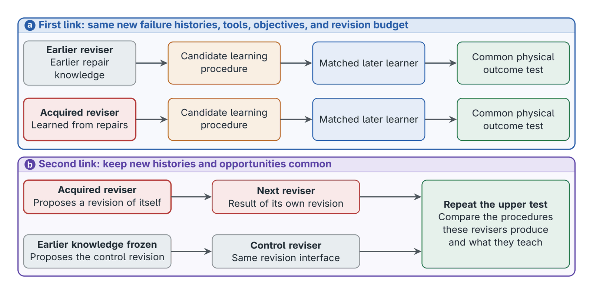

<!-- Generated by tools/render-readme.mjs. Edit the renderer, tools/survey-content.mjs or data/references.json. -->
<div align="center">
  <a href="https://eurekaleo.github.io/awesome-physical-ai-rsi/"></a>

  <p><strong><em>⭐ Star us if you find this useful!</em></strong></p>

  <a href="https://eurekaleo.github.io/awesome-physical-ai-rsi/"></a>
  <a href="#publication"></a>
  <a href="https://eurekaleo.github.io/awesome-physical-ai-rsi/#references"></a>
  <a href="LICENSE"></a>
  <a href="https://awesome.re"></a>

  <p>Meng Luo<sup>1</sup> · Jiajia Song<sup>1</sup> · Shanqing Xu<sup>2</sup> · Yanlin Li<sup>1</sup> · Kaixin Li<sup>1</sup> · Ziyang Luo<sup>3</sup> · Wei Chen<sup>2</sup> · Hongzhan Lin<sup>1</sup></p>
  <p><sub><sup>1</sup> National University of Singapore &nbsp;·&nbsp; <sup>2</sup> Huazhong University of Science and Technology &nbsp;·&nbsp; <sup>3</sup> Hong Kong Baptist University</sub></p>
</div>

<a id="publication"></a>

> [!NOTE]
> The manuscript is not yet public. This page summarizes it with the authors' approval; a link to the paper will follow its release.

<picture><source media="(prefers-color-scheme: dark)" srcset="assets/readme/icons/about-dark.svg"><source media="(prefers-color-scheme: light)" srcset="assets/readme/icons/about-light.svg"></picture>

## About the survey

What turns physical experience from a source of better behavior into a source of better learning? A correction can teach a motion, contact can reveal dynamics, and a recovery can become a reusable skill; the harder question is whether knowledge of *why* these changes worked can improve the procedure that produces the next change. The survey reserves *recursive self-improvement* (RSI) for a stronger relation: knowledge from earlier repairs improves the capability that revises that procedure, and the improved capability then helps improve itself.

To see what present systems establish, the survey follows acquired changes (policies, predictive models, reusable skills, software, and changes to collection, supervision, or updating) into their next use.

> [!IMPORTANT]
> **Four recurring conditions shape further improvement.**
>
> - **Signal specificity:** does the feedback address what the learner still lacks?
> - **Recipient compatibility:** can the receiving component use the change?
> - **Round-to-round shift:** does its value survive later changes in behavior and in the system?
> - **Physical continuation:** can informative trials continue under sensing, reset, safety, and resource limits?
>
> This view explains why successful data collection may yield poor teaching data, and why more accurate prediction may fail to improve control.

<p align="center"></p>
<p align="center"><sub><b>Figure 1. Learning behavior and learning how to improve it.</b> The upper loop applies a fixed recipe; the lower route retains repair knowledge that guides later learning. The dashed return asks whether that knowledge also improves how the next revision is made.</sub></p>

<picture><source media="(prefers-color-scheme: dark)" srcset="assets/readme/icons/questions-dark.svg"><source media="(prefers-color-scheme: light)" srcset="assets/readme/icons/questions-light.svg"></picture>

## Research questions

| | Question | What it asks |
| :-: | --- | --- |
| **RQ1** | **What limits the next improvement?** | Is useful experience missing, or is progress limited by supervision, optimization, action generation, interfaces, or retention? |
| **RQ2** | **Which changes address that limitation?** | How does experience change behavior, reusable models or skills, and the collection, supervision, curriculum, or update procedures used in later learning? |
| **RQ3** | **When can improvements build on one another?** | What lets one round improve the next, and what causes saturation, drift, or regression? |
| **RQ4** | **What changes in the physical world?** | How do sensing, embodiment, reset, safety, cost, and hardware changes constrain the process? |

<picture><source media="(prefers-color-scheme: dark)" srcset="assets/readme/icons/guide-dark.svg"><source media="(prefers-color-scheme: light)" srcset="assets/readme/icons/guide-light.svg"></picture>

## Repository guide

[About the survey](#about-the-survey) · [Research questions](#research-questions) · [The review at a glance](#the-review-at-a-glance) · [Four uses of acquired change](#four-uses-of-acquired-change) · [Toward recursive self-improvement](#toward-recursive-self-improvement) · [Open problems](#open-problems) · [References](#references) · [Contributing](#contributing) · [Contributors](#contributors) · [Star history](#star-history) · [Citation](#citation) · [Repository layout](#repository-layout) · [License](#license)

## Choose a section

Select a card to jump directly to its section.

<p align="center">
  <a href="#about-the-survey"><picture><source media="(prefers-color-scheme: dark)" srcset="assets/readme/card-about-dark.svg"><source media="(prefers-color-scheme: light)" srcset="assets/readme/card-about-light.svg"></picture></a>
  <a href="#research-questions"><picture><source media="(prefers-color-scheme: dark)" srcset="assets/readme/card-questions-dark.svg"><source media="(prefers-color-scheme: light)" srcset="assets/readme/card-questions-light.svg"></picture></a>
  <a href="#the-review-at-a-glance"><picture><source media="(prefers-color-scheme: dark)" srcset="assets/readme/card-framework-dark.svg"><source media="(prefers-color-scheme: light)" srcset="assets/readme/card-framework-light.svg"></picture></a>
  <br>
  <a href="#toward-recursive-self-improvement"><picture><source media="(prefers-color-scheme: dark)" srcset="assets/readme/card-recursion-dark.svg"><source media="(prefers-color-scheme: light)" srcset="assets/readme/card-recursion-light.svg"></picture></a>
  <a href="#open-problems"><picture><source media="(prefers-color-scheme: dark)" srcset="assets/readme/card-problems-dark.svg"><source media="(prefers-color-scheme: light)" srcset="assets/readme/card-problems-light.svg"></picture></a>
  <a href="#references"><picture><source media="(prefers-color-scheme: dark)" srcset="assets/readme/card-references-dark.svg"><source media="(prefers-color-scheme: light)" srcset="assets/readme/card-references-light.svg"></picture></a>
</p>

---

<picture><source media="(prefers-color-scheme: dark)" srcset="assets/readme/icons/framework-dark.svg"><source media="(prefers-color-scheme: light)" srcset="assets/readme/icons/framework-light.svg"></picture>

## The review at a glance

<p align="center"></p>
<p align="center"><sub><b>Figure 2. The review at a glance.</b> The rows give the four uses of an acquired change (Sections 3–6), the four conditions for carrying it into the next round, and the four claims a comparison can establish. Illustrations show the grasping robot’s four breakdowns from Section 1.</sub></p>

> [!NOTE]
> **What current evidence shows.** Existing experiments demonstrate behavioral gains, some later-learning benefits, and local procedure improvements, with detailed hardware evidence concentrated in manipulation. Isolating the causal chain that recursion requires is the next step.

<details>
<summary><b>Survey outline</b></summary>

| § | Chapter | Covers |
| :-: | --- | --- |
| 1 | **Introduction** |  |
| 2 | **Background and Framework** | Robot learning in brief · What this review covers · How each study is read · What counts as progress · Why physical experience differs |
| 3 | **Self-Improvement via Policy Updates** | From practice to training targets · From feedback to better actions · From proposals to policies · From single runs to lifelong practice |
| 4 | **Self-Improvement via World Models** | Using models to plan and train · Feeding models the right data · Shaping what models predict · Judging models by their use |
| 5 | **Self-Improvement via External Knowledge** | Remembering experience · Reusing skills and code · Transferring across robots |
| 6 | **Self-Improvement via Learning Procedure Updates** | Teaching the next learner · Choosing what to practice · Revising how success is judged · Learning how to update · Automating the experiment loop |
| 7 | **What Current Evidence Shows** | Evidence by claim · Limits of the evidence |
| 8 | **Why Self-Improvement Stalls** | When data stop teaching · When models and rewards fall behind · When bottlenecks move · When knowledge is lost or misused · When costs outrun gains |
| 9 | **Keeping Self-Improvement Safe** | Keeping practice possible · Protecting the judge · Admitting and undoing changes · Placing human oversight |
| 10 | **Toward Recursive Self-Improvement** | What recursion requires · How to test recursion |
| 11 | **Challenges and Future Directions** | Six open problems (below) |
| 12 | **Conclusion** |  |
| A–D | **Appendices** | Additional systems and learning settings · Reported outcomes and experimental context · Experimental interpretation · Glossary |

</details>

<p align="right"><sub><a href="#repository-guide">↑ Back to guide</a></sub></p>

<picture><source media="(prefers-color-scheme: dark)" srcset="assets/readme/icons/uses-dark.svg"><source media="(prefers-color-scheme: light)" srcset="assets/readme/icons/uses-light.svg"></picture>

## Four uses of acquired change

The same physical experience can leave very different kinds of change behind, and each has a different next user. Each system is placed by the use that its main experiment tests.

| Use | Retained change | Immediate use | Principal claim | Chapter |
| --- | --- | --- | --- | --- |
| **Behavior** | Policy, value, residual | Execute or choose actions | Better task behavior | §3 Policy updates |
| **Prediction and practice** | Dynamics or world model | Plan or supply training experience | Better decisions or learning | §4 World models |
| **Reuse and recovery** | Memory, skill, contract, program | Retrieve, recover, or synthesize | Reusable execution knowledge | §5 External knowledge |
| **Learning procedure** | Collector, evaluator, editor, updater | Choose experience, judge, or construct updates | Better subsequent learning | §6 Learning procedure updates |

<p align="center"></p>
<p align="center"><sub><b>Figure 3. Four later uses of acquired change.</b> Each column gives the retained change and its immediate use (Table 3). Dashed arrows show secondary handoffs: a policy may become a collector, a model may supply judgments, and memory may guide an updater.</sub></p>

<p align="right"><sub><a href="#repository-guide">↑ Back to guide</a></sub></p>

<picture><source media="(prefers-color-scheme: dark)" srcset="assets/readme/icons/recursion-dark.svg"><source media="(prefers-color-scheme: light)" srcset="assets/readme/icons/recursion-light.svg"></picture>

## Toward recursive self-improvement

<p align="center"></p>
<p align="center"><sub><b>Figure 6. Testing the two links of recursive self-improvement.</b> Top: does acquired repair knowledge make the reviser produce a better learning procedure on common new failures? Bottom: does a self-revision proposed with that knowledge beat one proposed with it frozen? The diagram specifies proposed comparisons, not reported results.</sub></p>

- **Useful results and revised procedures can already help the next learner.** Later-learning benefits and local procedure improvements are tested in several physical and simulated comparisons.
- **Repair knowledge can improve the reviser.** Testing this first link requires comparing the reviser with its earlier and its acquired repair knowledge.
- **The improved reviser must help improve itself.** This second link must hold under the same physical constraints that sustain ordinary learning.
- **Where to start.** Reward construction or skill-library editing: their revisions are inspectable, can be screened in simulation, and can then be confirmed on hardware through matched later learners. Eureka (a reward reviser whose knowledge does not change) and PRACTICE (a learned skill editor whose own reviser is fixed) already supply baselines.

<p align="right"><sub><a href="#repository-guide">↑ Back to guide</a></sub></p>

<picture><source media="(prefers-color-scheme: dark)" srcset="assets/readme/icons/problems-dark.svg"><source media="(prefers-color-scheme: light)" srcset="assets/readme/icons/problems-light.svg"></picture>

## Open problems

Six directions, the condition each mainly serves, its central question, and a benchmark from which a new project could start.

| Direction | Serves | Central question | Starting benchmark |
| --- | --- | --- | --- |
| **Finding the bottleneck** | Signal specificity | Which component limits the next improvement? | Injected policy, model, evaluator, and interface faults with similar terminal outcomes; held-out natural failures |
| **Choosing the next experiment** | Signal specificity | Which probe yields evidence that an available update can use? | Fixed starting system and budget; joint selection versus fixed, information-gain-only, and sequential baselines |
| **Keeping judges aligned** | Round-to-round shift | How can evaluators be refreshed without changing the intended task? | Fixed learner and data; varied evaluator and refresh rule; protected physical outcomes |
| **Transferring repair knowledge** | Recipient compatibility | Does knowledge about earlier repairs improve repairs on new failure families? | The two-round comparison of Figure 6 on held-out failure families |
| **Surviving system changes** | Recipient compatibility<br>Round-to-round shift | When should an artifact be reused, adapted, revalidated, or retired? | Declared changes to sensing, embodiment, timing, interfaces, and memory schemas, plus gradual drift |
| **Budgeting physical resources** | Physical continuation | How should robot time, human attention, compute, and wear be spent over time? | Task sequences with maintenance events under finite capacities; Pareto reporting of resources |

**Three near-term programs follow from this agenda:**

1. Combine cross-component diagnosis with joint experiment–update selection under matched multi-resource budgets.
2. Test versioned evaluators and repair knowledge on held-out failures and declared hardware or software changes, using protected outcome checks to separate transfer from drift.
3. Connect these tests across at least two causally isolated procedure-revision rounds, and report the full acquisition, maintenance, and revalidation ledger.

> *The first robot that becomes measurably better at rewriting its own recipe, even for a single family of failures, will mark the moment when physical experience begins to compound.*

<p align="right"><sub><a href="#repository-guide">↑ Back to guide</a></sub></p>

<picture><source media="(prefers-color-scheme: dark)" srcset="assets/readme/icons/references-dark.svg"><source media="(prefers-color-scheme: light)" srcset="assets/readme/icons/references-light.svg"></picture>

## References

229 bibliographic records from the survey, ordered from newest to oldest. Counts describe this collection; publication badges indicate the venue or record type. Inclusion does not imply that a paper demonstrates RSI. The [project website](https://eurekaleo.github.io/awesome-physical-ai-rsi/#references) adds search and filters.

| Conference | Journal | Preprint | Book | Other |
| ---: | ---: | ---: | ---: | ---: |
| 127 | 26 | 73 | 3 | 0 |

    

[2026](#year-2026) | [2025](#year-2025) | [2024](#year-2024) | [2023](#year-2023) | [2022](#year-2022) | [2021](#year-2021) | [2020](#year-2020) | [2019](#year-2019) | [2018](#year-2018) | [2017](#year-2017) | [2016](#year-2016) | [2015](#year-2015) | [2013](#year-2013) | [2012](#year-2012) | [2011](#year-2011) | [2009](#year-2009) | [2007](#year-2007) | [2006](#year-2006) | [2003](#year-2003) | [1999](#year-1999) | [1998](#year-1998) | [1996](#year-1996) | [1995](#year-1995) | [1990](#year-1990) | [1966](#year-1966)

<a id="year-2026"></a>

### 2026

- AllDayNav: Lifelong Navigation via Real-World Reinforcement Learning. [[paper](<https://arxiv.org/abs/2606.10927>)] 
- ASPIRE: Agentic /Skills Discovery for Robotics. [[paper](<https://arxiv.org/abs/2607.00272v1>)] 
- AtomicVLA: Unlocking the Potential of Atomic Skill Learning in Robots. 
- Beyond Imitation: Self-Improving Robot Policies via Off-Policy Q-Planning. [[paper](<https://arxiv.org/abs/2608.21204>)] 
- CaliBench: Are the Stochastic Dynamics of Video World Models Physically Calibrated? 
- CIDER: Continual Interactive Distillation for Embodied Reinforcement Learning. [[paper](<https://arxiv.org/abs/2608.21899>)] 
- CLARE: Continual Learning for Vision-Language-Action Models via Autonomous Adapter Routing and Expansion. [[paper](<https://doi.org/10.1109/LRA.2026.3693992>)] 
- ConfAL-WM: Confidence-Guided Active Learning for Action-Conditioned World Models. [[paper](<https://arxiv.org/abs/2608.25572>)] 
- Continual Robot Policy Learning via Variational Neural Dynamics. [[paper](<https://arxiv.org/abs/2606.27353>)] 
- D-JEPA: A Decision-Aligned Latent World Model. [[paper](<https://arxiv.org/abs/2609.24749v1>)] 
- Darwin Gödel Machine: Open-Ended Evolution of Self-Improving Agents. [[paper](<https://arxiv.org/abs/2505.22954>)] 
- DexTouch-WM: Learning Action-Conditioned Tactile World Models from Human Touch for Dexterous Robot Manipulation. [[paper](<https://arxiv.org/abs/2609.20649v2>)] 
- Do Better Imagined Rollouts Mean Better Robot Control? A Controlled Study of World-Model Evaluation Under Feedback. [[paper](<https://arxiv.org/abs/2609.02811>)] 
- Do Robotic World Models Really Follow Actions? Diagnosing and Aligning Action-Conditioned Generation for Policy Learning. [[paper](<https://arxiv.org/abs/2608.24885>)] 
- ENPIRE: Agentic Robot Policy Self-Improvement in the Real World. [[paper](<https://arxiv.org/abs/2606.19980>)] 
- FAN: Foresight Action Normalization for Continual Adaptation of Vision-Language-Action Models. [[paper](<https://arxiv.org/abs/2609.21358v1>)] 
- FIERCE: From Generalist Robot Policies to Fast Specialists via Progress-Failure Feedback. [[paper](<https://arxiv.org/abs/2609.18651v1>)] 
- From Generative Engines to Actionable Simulators: The Imperative of Physical Grounding in World Models. [[paper](<https://arxiv.org/abs/2601.15533>)] 
- GigaBrain-0.5M\*: a VLA That Learns From World Model-Based Reinforcement Learning. [[paper](<https://arxiv.org/abs/2602.12099>)] 
- HaWMPO: Hallucination-Aware World Model-based Policy Optimization for Generalist Robot Policy. [[paper](<https://arxiv.org/abs/2609.09941>)] 
- HIL-UMI: Bringing Human-in-the-Loop Post-Training of Vision-Language-Action Models to Universal Manipulation Interface. [[paper](<https://arxiv.org/abs/2609.20659v2>)] 
- Is Forward Prediction Enough? Physical State Grounding for JEPA World Models. [[paper](<https://arxiv.org/abs/2608.06799>)] 
- Learning Agile Quadrotor Flight in the Real World. [[paper](<https://arxiv.org/abs/2602.10111>)] 
- Learning and Transferring Closed-Loop Robot Software. [[paper](<https://arxiv.org/abs/2609.19906v1>)] 
- Learning Beyond What Humans Can Demonstrate. [[paper](<https://arxiv.org/abs/2609.24996v1>)] 
- Learning While Deploying: Fleet-Scale Reinforcement Learning for Generalist Robot Policies. [[paper](<https://arxiv.org/abs/2605.00416>)] 
- Mem-World: Memory-Augmented Action-Conditioned World Models for Persistent Robot Manipulation. [[paper](<https://arxiv.org/abs/2606.18960>)] 
- Memory Anchors for Continual Robot Learning. [[paper](<https://arxiv.org/abs/2608.26545>)] 
- Motus2: A Self-Evolving General World Model for Dexterous Manipulation. [[paper](<https://arxiv.org/abs/2608.30237>)] 
- Multisensory Continual Learning: Adapting Pretrained Visuomotor Policies to Force. [[paper](<https://arxiv.org/abs/2606.30988v4>)] 
- PhyAgentOS: A Self-Evolving Operating System for Embodied Agents with Decoupled Cognitive Planning and Physical Execution. [[paper](<https://arxiv.org/abs/2607.16636>)] 
- PlayWorld: Learning Robot World Models from Autonomous Play. [[paper](<https://arxiv.org/abs/2603.09030>)] 
- Policy-Level Recursive Self-Improvement for Embodied AI with a Criticality World Model. [[paper](<https://arxiv.org/abs/2607.28251>)] 
- PRACTICE: From Experience to Expertise in Self-Evolving Embodied Agents. [[paper](<https://arxiv.org/abs/2608.30760>)] 
- Recover, Discover, Plan: Learning Skills and Concepts from Robot Failures. [[paper](<https://arxiv.org/abs/2606.18328>)] 
- Recursive Self-Improvement in AI: From Bounded Self-Refinement to Autonomous Research Loops. [[paper](<https://arxiv.org/abs/2607.07663>)] 
- Reinforcement Learning for Real-Time Vision-Language-Action Policies. [[paper](<https://arxiv.org/abs/2609.18207v1>)] 
- REVOLVE: An Automated Closed-Loop Framework for Evolving Robot Manipulation with Minimal Human Intervention. [[paper](<https://arxiv.org/abs/2609.14633>)] 
- RISE: Self-Improving Robot Policy with Compositional World Model. [[paper](<https://arxiv.org/abs/2602.11075>)] 
- Robo-Cortex: A Self-Evolving Embodied Agent via Dual-Grain Cognitive Memory and Autonomous Knowledge Induction. [[paper](<https://arxiv.org/abs/2605.18729>)] 
- RoboReward: General-Purpose Vision-Language Reward Models for Robotics. [[paper](<https://arxiv.org/abs/2601.00675v2>)] 
- SARM2: Multi-Task Stage Aware Reward Modeling for Self Improving Robotic Manipulation. [[paper](<https://arxiv.org/abs/2606.10305>)] 
- Scaling Cross-Embodiment World Models for Dexterous Manipulation. [[paper](<https://arxiv.org/abs/2511.01177>)] 
- Self-adapting Robotic Agents through Online Continual Reinforcement Learning with World Model Feedback. [[paper](<https://arxiv.org/abs/2603.04029>)] 
- Self-Aware Active Learning Enables Continual Improvement in Autonomous Driving. [[paper](<https://arxiv.org/abs/2608.29772>)] 
- Self-Evolving AI for Humanoids: Mechanisms, Safety, and Evaluation of Post-Deployment Self-Improvement. [[paper](<https://arxiv.org/abs/2609.13236>)] 
- Self-Evolving Embodied Agents via Skill-Harness Evolution. [[paper](<https://arxiv.org/abs/2608.11350>)] 
- Self-evolving Embodied AI. [[paper](<https://arxiv.org/abs/2602.04411>)] 
- Self-Improving Loops for Visual Robotic Planning. [[paper](<https://arxiv.org/abs/2506.06658>)] 
- Self-Improving Vision-Language-Action Models with Data Generation via Residual RL. [[paper](<https://arxiv.org/abs/2511.00091v1>)] 
- SimpleVLA-RL: Scaling VLA Training via Reinforcement Learning. [[paper](<https://arxiv.org/abs/2509.09674v1>)] 
- SPIRAL: Self-Evolving Action-Conditioned Video Generation via Reflective Planning Agents. [[paper](<https://arxiv.org/abs/2603.08403>)] 
- Stable and Efficient Real-World Online VLA Post-Training via Asynchronous Replay-Anchored Policy Improvement. [[paper](<https://arxiv.org/abs/2609.22888v1>)] 
- TORL-VLA: Tactile Guided Online Reinforcement Learning for Contact-Rich Manipulation. [[paper](<https://arxiv.org/abs/2606.09337v3>)] 
- Towards Human-like Physical Intelligence: Lifelong Vision-Language-Action Learning for Robotic Manipulation. [[paper](<https://arxiv.org/abs/2607.14852>)] 
- Uni-Skill: Building Self-Evolving Skill Repository for Generalizable Robotic Manipulation. [[paper](<https://arxiv.org/abs/2603.02623>)] 
- VASO: Formally Verifiable Self-Evolving Skills for Physical AI Agents. [[paper](<https://arxiv.org/abs/2606.05395>)] 
- Visual Verification Enables Inference-time Steering and Autonomous Policy Improvement. [[paper](<https://doi.org/10.15607/RSS.2026.XXII.079>)] 
- VLAW: Iterative Co-Improvement of Vision-Language-Action Policy and World Model. 
- Weights or Skills? A Survey of Robot-Learning Techniques: from Action-Predicting Weights to Robots that Write their Own Skills. [[paper](<https://arxiv.org/abs/2608.01851v1>)] 
- What Can Latent World Models Know? Physical Information in Multimodal Predictive Representations. [[paper](<https://arxiv.org/abs/2607.27017>)] 
- When Validation Stops Learning: Auditing Update Admission for Continual Embodied Agents. [[paper](<https://arxiv.org/abs/2609.10873>)] 
- WISE: World-model-guided Imagination Scheduling for Efficient Post-training of Vision-Language-Action Models. [[paper](<https://arxiv.org/abs/2609.03681>)] 
- World Model for Robot Learning: A Comprehensive Survey. [[paper](<https://arxiv.org/abs/2605.00080>)] 
- World Models for Robotic Manipulation: A Survey. [[paper](<https://arxiv.org/abs/2606.00113>)] 
- World-Action Models for Robot Learning and Control: A Survey. [[paper](<https://arxiv.org/abs/2609.16074>)] 
- XEWorld: Can Action-Conditioned World Models Generalize to Unseen Robot Embodiments? [[paper](<https://arxiv.org/abs/2608.05799>)] 
- XPACE: Joint World and Action Modeling from Heterogeneous Experience. [[paper](<https://arxiv.org/abs/2609.17372>)] 
- Zetta ζ: An Efficient Closed-Loop Embodied Harness for Self-Evolving Physical Intelligence. [[paper](<https://arxiv.org/abs/2608.16590>)] 
- Zeva: In-Context Causal Learning for Generalizable Embodied Manipulation. [[paper](<https://arxiv.org/abs/2608.30880>)] 
- π\*₀.₆: a VLA That Learns From Experience. [[paper](<https://doi.org/10.15607/RSS.2026.XXII.087>)] 

<a id="year-2025"></a>

<details>
<summary><strong>2025</strong> &middot; 31 references</summary>

- AHA: A Vision-Language-Model for Detecting and Reasoning Over Failures in Robotic Manipulation. [[paper](<https://arxiv.org/abs/2410.00371>)] 
- Aligning Perception, Reasoning, Modeling and Interaction: A Survey on Physical AI. [[paper](<https://arxiv.org/abs/2510.04978>)] 
- AlphaEvolve: A Coding Agent for Scientific and Algorithmic Discovery. [[paper](<https://arxiv.org/abs/2506.13131>)] 
- Automated Design of Agentic Systems. 
- Autonomous Improvement of Instruction Following Skills via Foundation Models. 
- Cosmos World Foundation Model Platform for Physical AI. [[paper](<https://arxiv.org/abs/2501.03575>)] 
- Diffusion Policy Policy Optimization. [[paper](<https://arxiv.org/abs/2409.00588>)] 
- DINO-WM: World Models on Pre-trained Visual Features enable Zero-shot Planning. [[paper](<https://arxiv.org/abs/2411.04983>)] 
- DreamGen: Unlocking Generalization in Robot Learning through Video World Models. 
- EmbodiedBench: Comprehensive Benchmarking Multi-modal Large Language Models for Vision-Driven Embodied Agents. [[paper](<https://arxiv.org/abs/2502.09560>)] 
- Environment Curriculum Generation via Large Language Models. 
- FLaRe: Achieving Masterful and Adaptive Robot Policies with Large-Scale Reinforcement Learning Fine-Tuning. [[paper](<https://doi.org/10.1109/ICRA55743.2025.11127934>)] 
- From Imitation to Refinement – Residual RL for Precise Assembly. [[paper](<https://doi.org/10.1109/ICRA55743.2025.11127442>)] 
- iManip: Skill-Incremental Learning for Robotic Manipulation. [[paper](<https://arxiv.org/abs/2503.07087>)] 
- LIBERO-PRO: Towards Robust and Fair Evaluation of Vision-Language-Action Models Beyond Memorization. [[paper](<https://arxiv.org/abs/2510.03827v2>)] 
- Mastering Diverse Control Tasks Through World Models. [[paper](<https://doi.org/10.1038/s41586-025-08744-2>)] 
- PISA Experiments: Exploring Physics Post-Training for Video Diffusion Models by Watching Stuff Drop. [[paper](<https://arxiv.org/abs/2503.09595>)] 
- Precise and Dexterous Robotic Manipulation via Human-in-the-Loop Reinforcement Learning. [[paper](<https://doi.org/10.1126/scirobotics.ads5033>)] 
- Provably-Safe, Online System Identification. [[paper](<https://doi.org/10.15607/RSS.2025.XXI.121>)] 
- ReWiND: Language-Guided Rewards Teach Robot Policies without New Demonstrations. [[paper](<https://arxiv.org/abs/2505.10911v2>)] 
- RoboMemory: A Brain-inspired Multi-memory Agentic Framework for Interactive Environmental Learning in Physical Embodied Systems. [[paper](<https://arxiv.org/abs/2508.01415>)] 
- RoboTwin 2.0: A Scalable Data Generator and Benchmark with Strong Domain Randomization for Robust Bimanual Robotic Manipulation. [[paper](<https://arxiv.org/abs/2506.18088>)] 
- Self-Improving Embodied Foundation Models. [[paper](<https://arxiv.org/abs/2509.15155>)] 
- So You Think You Can Scale Up Autonomous Robot Data Collection? 
- Steering Your Diffusion Policy with Latent Space Reinforcement Learning. [[paper](<https://arxiv.org/abs/2506.15799v2>)] 
- V-JEPA 2: Self-Supervised Video Models Enable Understanding, Prediction and Planning. [[paper](<https://arxiv.org/abs/2506.09985>)] 
- VLA-RL: Towards Masterful and General Robotic Manipulation with Scalable Reinforcement Learning. [[paper](<https://arxiv.org/abs/2505.18719v1>)] 
- VLABench: A Large-Scale Benchmark for Language-Conditioned Robotics Manipulation with Long-Horizon Reasoning Tasks. [[paper](<https://doi.org/10.1109/ICCV51701.2025.01037>)] 
- WISA: World Simulator Assistant for Physics-Aware Text-to-Video Generation. [[paper](<https://doi.org/10.52202/085713-0191>)] 
- π₀: A Vision-Language-Action Flow Model for General Robot Control. [[paper](<https://arxiv.org/abs/2410.24164v4>)] 
- π₀.₅: a Vision-Language-Action Model with Open-World Generalization. [[paper](<https://arxiv.org/abs/2504.16054>)] 

</details>

<a id="year-2024"></a>

<details>
<summary><strong>2024</strong> &middot; 35 references</summary>

- AI models collapse when trained on recursively generated data. [[paper](<https://doi.org/10.1038/s41586-024-07566-y>)] 
- AutoRT: Embodied Foundation Models for Large Scale Orchestration of Robotic Agents. [[paper](<https://arxiv.org/abs/2401.12963>)] 
- DrEureka: Language Model Guided Sim-To-Real Transfer. [[paper](<https://doi.org/10.15607/RSS.2024.XX.094>)] 
- DROID: A Large-Scale In-The-Wild Robot Manipulation Dataset. [[paper](<https://arxiv.org/abs/2403.12945v2>)] 
- Eureka: Human-Level Reward Design via Coding Large Language Models. 
- Evaluating Real-World Robot Manipulation Policies in Simulation. [[paper](<https://arxiv.org/abs/2405.05941v1>)] 
- Genie: Generative Interactive Environments. 
- GenSim: Generating Robotic Simulation Tasks via Large Language Models. 
- Learning Interactive Real-World Simulators. 
- Lifelong Robot Learning with Human Assisted Language Planners. [[paper](<https://arxiv.org/abs/2309.14321>)] 
- Lifelong Robot Library Learning: Bootstrapping Composable and Generalizable Skills for Embodied Control with Language Models. [[paper](<https://arxiv.org/abs/2406.18746v2>)] 
- LOTUS: Continual Imitation Learning for Robot Manipulation Through Unsupervised Skill Discovery. [[paper](<https://arxiv.org/abs/2311.02058>)] 
- Model-Based Runtime Monitoring with Interactive Imitation Learning. [[paper](<https://arxiv.org/abs/2310.17552>)] 
- Octo: An Open-Source Generalist Robot Policy. [[paper](<https://arxiv.org/abs/2405.12213>)] 
- OMNI: Open-endedness via Models of human Notions of Interestingness. 
- Open X-Embodiment: Robotic Learning Datasets and RT-X Models. [[paper](<https://doi.org/10.1109/ICRA57147.2024.10611477>)] 
- OpenBot-Fleet: A System for Collective Learning with Real Robots. [[paper](<https://arxiv.org/abs/2405.07515>)] 
- OpenVLA: An Open-Source Vision-Language-Action Model. [[paper](<https://arxiv.org/abs/2406.09246v3>)] 
- Policy Agnostic RL: Offline RL and Online RL Fine-Tuning of Any Class and Backbone. [[paper](<https://arxiv.org/abs/2412.06685v1>)] 
- Promptbreeder: Self-Referential Self-Improvement Via Prompt Evolution. 
- RL-VLM-F: Reinforcement Learning from Vision Language Foundation Model Feedback. [[paper](<https://arxiv.org/abs/2402.03681>)] 
- RoboCasa: Large-Scale Simulation of Everyday Tasks for Generalist Robots. [[paper](<https://arxiv.org/abs/2406.02523v1>)] 
- RoboCat: A Self-Improving Generalist Agent for Robotic Manipulation. [[paper](<https://arxiv.org/abs/2306.11706>)] 
- RoboGen: Towards Unleashing Infinite Data for Automated Robot Learning via Generative Simulation. 
- Robot Fine-Tuning Made Easy: Pre-Training Rewards and Policies for Autonomous Real-World Reinforcement Learning. [[paper](<https://doi.org/10.1109/ICRA57147.2024.10610421>)] 
- Self-Consuming Generative Models Go MAD. 
- Self-Taught Optimizer (STOP): Recursively Self-Improving Code Generation. 
- SERL: A Software Suite for Sample-Efficient Robotic Reinforcement Learning. [[paper](<https://arxiv.org/abs/2401.16013>)] 
- Steering Your Generalists: Improving Robotic Foundation Models via Value Guidance. [[paper](<https://arxiv.org/abs/2410.13816v2>)] 
- TD-MPC2: Scalable, Robust World Models for Continuous Control. 
- Text2Reward: Reward Shaping with Language Models for Reinforcement Learning. 
- The AI Scientist: Towards Fully Automated Open-Ended Scientific Discovery. [[paper](<https://arxiv.org/abs/2408.06292>)] 
- Universal Manipulation Interface: In-The-Wild Robot Teaching Without In-The-Wild Robots. [[paper](<https://arxiv.org/abs/2402.10329>)] 
- Vision-Language Models are Zero-Shot Reward Models for Reinforcement Learning. [[paper](<https://arxiv.org/abs/2310.12921>)] 
- Voyager: An Open-Ended Embodied Agent with Large Language Models. 

</details>

<a id="year-2023"></a>

<details>
<summary><strong>2023</strong> &middot; 24 references</summary>

- ALAN: Autonomously Exploring Robotic Agents in the Real World. [[paper](<https://arxiv.org/abs/2302.06604>)] 
- An autonomous laboratory for the accelerated synthesis of inorganic materials. [[paper](<https://doi.org/10.1038/s41586-023-06734-w>)] 
- Autonomous chemical research with large language models. [[paper](<https://doi.org/10.1038/s41586-023-06792-0>)] 
- Cal-QL: Calibrated Offline RL Pre-Training for Efficient Online Fine-Tuning. [[paper](<https://arxiv.org/abs/2303.05479>)] 
- Code as Policies: Language Model Programs for Embodied Control. [[paper](<https://doi.org/10.1109/ICRA48891.2023.10160591>)] 
- Data Quality in Imitation Learning. [[paper](<https://doi.org/10.52202/075280-3524>)] 
- DayDreamer: World Models for Physical Robot Learning. 
- Diffusion Policy: Visuomotor Policy Learning via Action Diffusion. [[paper](<https://arxiv.org/abs/2303.04137v1>)] 
- Do As I Can, Not As I Say: Grounding Language in Robotic Affordances. 
- Efficient Online Reinforcement Learning with Offline Data. [[paper](<https://arxiv.org/abs/2302.02948>)] 
- Inner Monologue: Embodied Reasoning through Planning with Language Models. [[paper](<https://arxiv.org/abs/2207.05608>)] 
- Language to Rewards for Robotic Skill Synthesis. [[paper](<https://arxiv.org/abs/2306.08647>)] 
- Learning Universal Policies via Text-Guided Video Generation. [[paper](<https://doi.org/10.52202/075280-0403>)] 
- LIBERO: Benchmarking Knowledge Transfer for Lifelong Robot Learning. [[paper](<https://arxiv.org/abs/2306.03310v2>)] 
- LIV: Language-Image Representations and Rewards for Robotic Control. 
- REFLECT: Summarizing Robot Experiences for Failure Explanation and Correction. [[paper](<https://arxiv.org/abs/2306.15724>)] 
- Reflexion: Language Agents with Verbal Reinforcement Learning. [[paper](<https://doi.org/10.52202/075280-0377>)] 
- Reward Design with Language Models. [[paper](<https://arxiv.org/abs/2303.00001>)] 
- RoboCLIP: One Demonstration is Enough to Learn Robot Policies. [[paper](<https://arxiv.org/abs/2310.07899>)] 
- Robot Learning on the Job: Human-in-the-Loop Autonomy and Learning During Deployment. [[paper](<https://arxiv.org/abs/2211.08416>)] 
- RT-1: Robotics Transformer for Real-World Control at Scale. [[paper](<https://arxiv.org/abs/2212.06817>)] 
- RT-2: Vision-Language-Action Models Transfer Web Knowledge to Robotic Control. [[paper](<https://arxiv.org/abs/2307.15818>)] 
- Self-Improving Robots: End-to-End Autonomous Visuomotor Reinforcement Learning. [[paper](<https://arxiv.org/abs/2303.01488>)] 
- VIP: Towards Universal Visual Reward and Representation via Value-Implicit Pre-Training. [[paper](<https://arxiv.org/abs/2210.00030>)] 

</details>

<a id="year-2022"></a>

<details>
<summary><strong>2022</strong> &middot; 8 references</summary>

- Autotelic Agents with Intrinsically Motivated Goal-Conditioned Reinforcement Learning: A Short Survey. [[paper](<https://doi.org/10.1613/jair.1.13554>)] 
- Fleet-DAgger: Interactive Robot Fleet Learning with Scalable Human Supervision. [[paper](<https://arxiv.org/abs/2206.14349>)] 
- Fully Autonomous Real-World Reinforcement Learning with Applications to Mobile Manipulation. 
- Lifelong Robotic Reinforcement Learning by Retaining Experiences. 
- Safe Learning in Robotics: From Learning-Based Control to Safe Reinforcement Learning. [[paper](<https://doi.org/10.1146/annurev-control-042920-020211>)] 
- Scaling Up Multi-Task Robotic Reinforcement Learning. 
- STaR: Bootstrapping Reasoning With Reasoning. [[paper](<https://doi.org/10.52202/068431-1126>)] 
- ThriftyDAgger: Budget-Aware Novelty and Risk Gating for Interactive Imitation Learning. [[paper](<https://arxiv.org/abs/2109.08273>)] 

</details>

<a id="year-2021"></a>

<details>
<summary><strong>2021</strong> &middot; 5 references</summary>

- CausalWorld: A Robotic Manipulation Benchmark for Causal Structure and Transfer Learning. 
- PEBBLE: Feedback-Efficient Interactive Reinforcement Learning via Relabeling Experience and Unsupervised Pre-training. [[paper](<https://arxiv.org/abs/2106.05091v1>)] 
- Recovery RL: Safe Reinforcement Learning With Learned Recovery Zones. [[paper](<https://arxiv.org/abs/2010.15920>)] 
- Reward tampering problems and solutions in reinforcement learning: a causal influence diagram perspective. [[paper](<https://doi.org/10.1007/s11229-021-03141-4>)] 
- RMA: Rapid Motor Adaptation for Legged Robots. [[paper](<https://arxiv.org/abs/2107.04034>)] 

</details>

<a id="year-2020"></a>

<details>
<summary><strong>2020</strong> &middot; 9 references</summary>

- A mobile robotic chemist. [[paper](<https://doi.org/10.1038/s41586-020-2442-2>)] 
- Automatic Curriculum Learning For Deep RL: A Short Survey. [[paper](<https://doi.org/10.24963/ijcai.2020/671>)] 
- AutoML-Zero: Evolving Machine Learning Algorithms From Scratch. 
- Discovering Reinforcement Learning Algorithms. 
- Dream to Control: Learning Behaviors by Latent Imagination. 
- Enhanced POET: Open-Ended Reinforcement Learning through Unbounded Invention of Learning Challenges and Their Solutions. 
- Objective Mismatch in Model-based Reinforcement Learning. 
- RoboNet: Large-Scale Multi-Robot Learning. 
- The Value Equivalence Principle for Model-Based Reinforcement Learning. 

</details>

<a id="year-2019"></a>

<details>
<summary><strong>2019</strong> &middot; 8 references</summary>

- Continual Lifelong Learning with Neural Networks: A Review. [[paper](<https://doi.org/10.1016/j.neunet.2019.01.012>)] 
- Control Barrier Functions: Theory and Applications. [[paper](<https://arxiv.org/abs/1903.11199>)] 
- Habitat: A Platform for Embodied AI Research. [[paper](<https://arxiv.org/abs/1904.01201>)] 
- HG-DAgger: Interactive Imitation Learning with Human Experts. [[paper](<https://doi.org/10.1109/ICRA.2019.8793698>)] 
- Learning to Adapt in Dynamic, Real-World Environments Through Meta-Reinforcement Learning. [[paper](<https://arxiv.org/abs/1803.11347v6>)] 
- Meta-World: A Benchmark and Evaluation for Multi-Task and Meta Reinforcement Learning. [[paper](<https://arxiv.org/abs/1910.10897>)] 
- Solving Rubik's Cube with a Robot Hand. [[paper](<https://arxiv.org/abs/1910.07113>)] 
- When to Trust Your Model: Model-Based Policy Optimization. [[paper](<https://arxiv.org/abs/1906.08253v3>)] 

</details>

<a id="year-2018"></a>

<details>
<summary><strong>2018</strong> &middot; 9 references</summary>

- Deep Reinforcement Learning in a Handful of Trials using Probabilistic Dynamics Models. [[paper](<https://arxiv.org/abs/1805.12114v2>)] 
- Evolved Policy Gradients. 
- Learning by Playing—Solving Sparse Reward Tasks from Scratch. 
- Leave no Trace: Learning to Reset for Safe and Autonomous Reinforcement Learning. [[paper](<https://arxiv.org/abs/1711.06782v1>)] 
- Meta-Gradient Reinforcement Learning. 
- Recurrent World Models Facilitate Policy Evolution. 
- Reinforcement Learning: An Introduction. 
- Safe Reinforcement Learning via Shielding. [[paper](<https://doi.org/10.1609/aaai.v32i1.11797>)] 
- Scalable Deep Reinforcement Learning for Vision-Based Robotic Manipulation. 

</details>

<a id="year-2017"></a>

<details>
<summary><strong>2017</strong> &middot; 6 references</summary>

- Gradient Episodic Memory for Continual Learning. 
- Hindsight Experience Replay. [[paper](<https://arxiv.org/abs/1707.01495v3>)] 
- Model-Agnostic Meta-Learning for Fast Adaptation of Deep Networks. 
- Self-Supervised Visual Planning with Temporal Skip Connections. 
- Thinking Fast and Slow with Deep Learning and Tree Search. 
- Value-Aware Loss Function for Model-based Reinforcement Learning. 

</details>

<a id="year-2016"></a>

<details>
<summary><strong>2016</strong> &middot; 4 references</summary>

- Concrete Problems in AI Safety. [[paper](<https://arxiv.org/abs/1606.06565>)] 
- Learning to reinforcement learn. [[paper](<https://arxiv.org/abs/1611.05763>)] 
- RL²: Fast Reinforcement Learning via Slow Reinforcement Learning. [[paper](<https://arxiv.org/abs/1611.02779>)] 
- Supersizing Self-Supervision: Learning to Grasp from 50K Tries and 700 Robot Hours. [[paper](<https://doi.org/10.1109/ICRA.2016.7487517>)] 

</details>

<a id="year-2015"></a>

<details>
<summary><strong>2015</strong> &middot; 2 references</summary>

- A Comprehensive Survey on Safe Reinforcement Learning. 
- Robots That Can Adapt Like Animals. [[paper](<https://doi.org/10.1038/nature14422>)] 

</details>

<a id="year-2013"></a>

<details>
<summary><strong>2013</strong> &middot; 2 references</summary>

- Active Learning of Inverse Models with Intrinsically Motivated Goal Exploration in Robots. [[paper](<https://doi.org/10.1016/j.robot.2012.05.008>)] 
- Reinforcement Learning in Robotics: A Survey. [[paper](<https://doi.org/10.1177/0278364913495721>)] 

</details>

<a id="year-2012"></a>

<details>
<summary><strong>2012</strong> &middot; 1 references</summary>

- Safe Exploration in Markov Decision Processes. 

</details>

<a id="year-2011"></a>

<details>
<summary><strong>2011</strong> &middot; 4 references</summary>

- A Reduction of Imitation Learning and Structured Prediction to No-Regret Online Learning. 
- Horde: A Scalable Real-Time Architecture for Learning Knowledge from Unsupervised Sensorimotor Interaction. 
- PILCO: A Model-Based and Data-Efficient Approach to Policy Search. 
- RoboEarth—A World Wide Web for Robots. [[paper](<https://doi.org/10.1109/MRA.2011.941632>)] 

</details>

<a id="year-2009"></a>

<details>
<summary><strong>2009</strong> &middot; 1 references</summary>

- A Survey of Robot Learning from Demonstration. [[paper](<https://doi.org/10.1016/j.robot.2008.10.024>)] 

</details>

<a id="year-2007"></a>

<details>
<summary><strong>2007</strong> &middot; 1 references</summary>

- Intrinsic Motivation Systems for Autonomous Mental Development. [[paper](<https://doi.org/10.1109/tevc.2006.890271>)] 

</details>

<a id="year-2006"></a>

<details>
<summary><strong>2006</strong> &middot; 1 references</summary>

- Resilient Machines Through Continuous Self-Modeling. [[paper](<https://doi.org/10.1126/science.1133687>)] 

</details>

<a id="year-2003"></a>

<details>
<summary><strong>2003</strong> &middot; 1 references</summary>

- Goedel Machines: Self-Referential Universal Problem Solvers Making Provably Optimal Self-Improvements. [[paper](<https://arxiv.org/abs/cs/0309048>)] 

</details>

<a id="year-1999"></a>

<details>
<summary><strong>1999</strong> &middot; 1 references</summary>

- Between MDPs and Semi-MDPs: A Framework for Temporal Abstraction in Reinforcement Learning. [[paper](<https://doi.org/10.1016/S0004-3702(99)00052-1>)] 

</details>

<a id="year-1998"></a>

<details>
<summary><strong>1998</strong> &middot; 1 references</summary>

- Learning to Learn. [[paper](<https://doi.org/10.1007/978-1-4615-5529-2>)] 

</details>

<a id="year-1996"></a>

<details>
<summary><strong>1996</strong> &middot; 1 references</summary>

- Active Learning with Statistical Models. [[paper](<https://doi.org/10.1613/jair.295>)] 

</details>

<a id="year-1995"></a>

<details>
<summary><strong>1995</strong> &middot; 1 references</summary>

- Lifelong Robot Learning. [[paper](<https://doi.org/10.1016/0921-8890(95)00004-Y>)] 

</details>

<a id="year-1990"></a>

<details>
<summary><strong>1990</strong> &middot; 1 references</summary>

- Integrated Architectures for Learning, Planning, and Reacting Based on Approximating Dynamic Programming. [[paper](<https://doi.org/10.1016/B978-1-55860-141-3.50030-4>)] 

</details>

<a id="year-1966"></a>

<details>
<summary><strong>1966</strong> &middot; 1 references</summary>

- Speculations Concerning the First Ultraintelligent Machine. [[paper](<https://doi.org/10.1016/s0065-2458(08)60418-0>)] 

</details>

<p align="right"><sub><a href="#repository-guide">↑ Back to guide</a></sub></p>

<picture><source media="(prefers-color-scheme: dark)" srcset="assets/readme/icons/contribute-dark.svg"><source media="(prefers-color-scheme: light)" srcset="assets/readme/icons/contribute-light.svg"></picture>

## Contributing

Found incorrect metadata or a broken link? [Open an issue](https://github.com/Eurekaleo/awesome-physical-ai-rsi/issues/new/choose) or follow [CONTRIBUTING.md](CONTRIBUTING.md). Contributions currently cover public reference metadata and the project website.

<p align="right"><sub><a href="#repository-guide">↑ Back to guide</a></sub></p>

<picture><source media="(prefers-color-scheme: dark)" srcset="assets/readme/icons/contributors-dark.svg"><source media="(prefers-color-scheme: light)" srcset="assets/readme/icons/contributors-light.svg"></picture>

## Contributors

Thanks to everyone who has corrected references and improved the project.

<a href="https://github.com/Eurekaleo/awesome-physical-ai-rsi/graphs/contributors"></a>

<p align="right"><sub><a href="#repository-guide">↑ Back to guide</a></sub></p>

<picture><source media="(prefers-color-scheme: dark)" srcset="assets/readme/icons/star-dark.svg"><source media="(prefers-color-scheme: light)" srcset="assets/readme/icons/star-light.svg"></picture>

## Star history

<p align="center">
  <a href="https://star-history.com/#Eurekaleo/awesome-physical-ai-rsi&Date">
    <picture>
      <source media="(prefers-color-scheme: dark)" srcset="https://api.star-history.com/svg?repos=Eurekaleo/awesome-physical-ai-rsi&type=Date&theme=dark">
      <source media="(prefers-color-scheme: light)" srcset="https://api.star-history.com/svg?repos=Eurekaleo/awesome-physical-ai-rsi&type=Date">
      
    </picture>
  </a>
</p>

<p align="right"><sub><a href="#repository-guide">↑ Back to guide</a></sub></p>

<picture><source media="(prefers-color-scheme: dark)" srcset="assets/readme/icons/cite-dark.svg"><source media="(prefers-color-scheme: light)" srcset="assets/readme/icons/cite-light.svg"></picture>

## Citation

If you find the survey or the reference library useful, please cite:

```bibtex
@misc{luo2026physicalrsi,
  title        = {From Physical Experience to Recursive Self-Improvement: Mechanisms, Evidence, and Open Problems in Physical AI},
  author       = {Luo, Meng and Song, Jiajia and Xu, Shanqing and Li, Yanlin and Li, Kaixin and Luo, Ziyang and Chen, Wei and Lin, Hongzhan},
  year         = {2026},
  howpublished = {\url{https://github.com/Eurekaleo/awesome-physical-ai-rsi}},
  note         = {Manuscript}
}
```

<p align="right"><sub><a href="#repository-guide">↑ Back to guide</a></sub></p>

<picture><source media="(prefers-color-scheme: dark)" srcset="assets/readme/icons/layout-dark.svg"><source media="(prefers-color-scheme: light)" srcset="assets/readme/icons/layout-light.svg"></picture>

## Repository layout

| Path | Purpose |
| --- | --- |
| [`data/references.json`](data/references.json) | Shared public bibliographic metadata |
| [`site/`](site/) | Website styles and browser code |
| [`assets/`](assets/) | Public artwork, README figures and asset credits |
| [`tools/`](tools/) | README generation and artwork, validation, build, and preview |

[Bibliography updates](data/README.md) | [Maintenance](docs/MAINTENANCE.md) | [Deployment](docs/DEPLOYMENT.md) | [Publication checklist](docs/PUBLICATION.md) | [Asset credits](assets/CREDITS.md)

<p align="right"><sub><a href="#repository-guide">↑ Back to guide</a></sub></p>

<picture><source media="(prefers-color-scheme: dark)" srcset="assets/readme/icons/license-dark.svg"><source media="(prefers-color-scheme: light)" srcset="assets/readme/icons/license-light.svg"></picture>

## License

The original website code and technical documentation are available under the [MIT License](LICENSE). The survey figures and summary text are © the authors and appear here with their approval; they are not covered by the code license. Linked publications, third-party assets, and publication text retain their respective rights and licenses. See [asset credits](assets/CREDITS.md).
